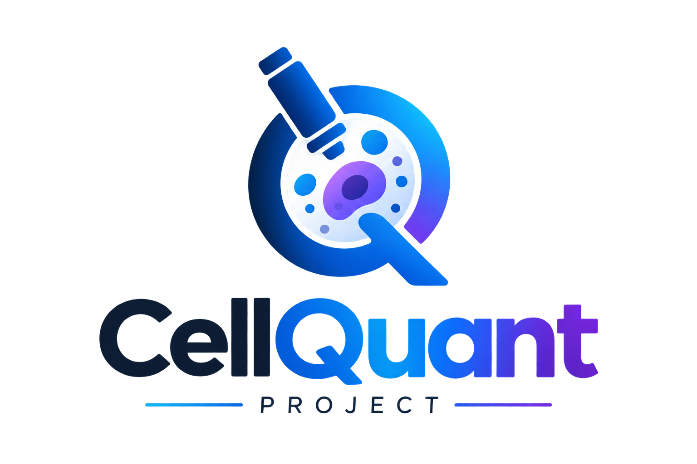
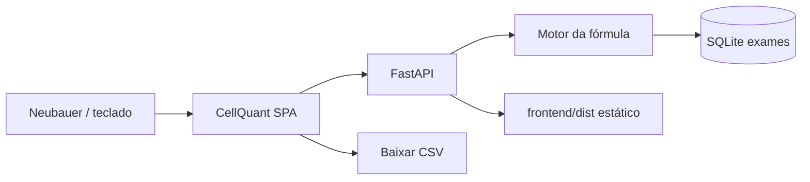

<p align="center">
  
</p>

<p align="left">
  
  
  
  
  
  
  <a href="https://github.com/BrunoFOmena/CellQuant-Project/actions/workflows/ci.yml"></a>
</p>

# CellQuant

**Da câmara de Neubauer ao laudo celular de LCR.**

**Autores:** Bruno Omena e José Marcos.

CellQuant é a **SPA** entre o microscópio e o registro do exame. O técnico conta células de LCR na bancada; a aplicação converte teclas e cliques em células/µL, e o FastAPI grava o laudo em SQLite — sem LIS, sem Docker, sem sair da bancada.

O laboratório já tem a câmara. O que falta é transformar a contagem ao vivo em um exame reproduzível, consultável e exportável.

---

## 📚 Hub de documentação

| Módulo | Link | Conteúdo |
|--------|------|----------|
| 🖥️ **SPA (React)** | [`frontend/README.md`](frontend/README.md) | Abas, Vite, Vitest e a interface de contagem |
| ⚙️ **API** | [`backend/README.md`](backend/README.md) | FastAPI, endpoints e o `frontend/dist` |
| 🗄️ **SQLite** | [`bd/README.md`](bd/README.md) | Schema, seed (só teste) e backup |
| 🧮 **Fórmula** | [`#a-fórmula`](#-a-fórmula) | Volume da Neubauer, leucócitos, hemácias, diferencial |
| ⌨️ **Contagem** | [`#o-que-o-cellquant-faz`](#-o-que-o-cellquant-faz) | Teclas 1–6, céls/µL ao vivo, laudo, CSV |
| 🗺️ **Status** | [`#status`](#-status) | O que já roda, o MVP e o que fica de fora |
| 🌿 **GitHub Flow** | [`#github-flow`](#-github-flow) | `main` + branches curtas + PR |
| 🖥️ **Laboratório** | [`#cli`](#-cli) | `cellquant start` e os outros comandos |
| 🚫 **Escopo** | [`#fora-de-escopo`](#-fora-de-escopo) | O que o CellQuant não faz |

---

## ⚠️ O problema

A citologia de LCR continua um ato de bancada: câmara de Neubauer, marcação, calculadora, depois planilha ou caderno. A fórmula é simples; os modos de falha não são — quadrante errado, diluição esquecida, diferencial que não fecha, resultado que ninguém acha na semana seguinte.

O desfecho típico: o microscópio está lá, a contagem aconteceu — e o laboratório ainda não tem um registro longitudinal daquele exame.

## 🔧 O que o CellQuant faz

```
Microscópio · câmara de Neubauer
        │  teclas 1–6 · botões
        ▼
   CellQuant SPA (React)
        │  céls/µL ao vivo + % do diferencial
        ├── Registro     operador · prontuário · data
        ├── Contador     leucócitos · hemácias · poli/mono
        ├── Laudo        revisão → POST /exames
        └── Consulta     filtro · detalhe · CSV
        │
        ▼
   FastAPI  →  SQLite (data/contador_lcr.db)
        │      fórmula recalculada no servidor
        ▼
   SPA estática servida no mesmo processo
```

| Capacidade | Entrega |
|------------|---------|
| **SPA** | Um shell, seis telas — sem recarregar a página; estado no `AppContext` |
| **Contador no teclado** | `1` leucócito · `2` hemácia · `3` poli · `4` mono · `5` desfazer · `6` zerar |
| **Fórmula canônica** | A mesma conta da Neubauer em TypeScript (prévia) e em Python (fonte da verdade) |
| **Laudo** | Operador, prontuário, contagens, céls/µL, % poli/mono, observações |
| **Histórico** | Filtro por prontuário / operador / data · paginação · detalhe |
| **Exportação** | **Baixar CSV** na Consulta (sem Google Sheets) |
| **Referência** | Metodologia (passos da câmara) e significado clínico (apoio, não diagnóstico) |
| **Runtime do lab** | Um processo Python serve API + SPA compilada na porta 8000 |

> Não substitui o LIS. Não prescreve. Não fecha diagnóstico. Conta, calcula, grava e serve o exame para quem está na bancada.

## 🎯 Para quem é

- Laboratórios clínicos que contam LCR em câmara de Neubauer e ainda registram o resultado à mão
- Biomédicos e técnicos que precisam de um contador orientado ao teclado, ao lado do microscópio
- Serviços pequenos que querem histórico local e CSV — não um sistema hospitalar
- Equipes que exigem a mesma fórmula na interface e na API, coberta por testes

O domínio profundo — e único — é a **citologia de LCR**: leucócitos, hemácias e diferencial poli/mono. Metodologia e significado clínico moram na mesma SPA, como referência, não como um segundo produto.

## 🧮 A fórmula

A fórmula não é rodapé. É o produto: prévia na SPA, **recalculada no POST**, nunca confiando no valor que o cliente enviou.

```
células/µL = total contado ÷ (nº quadrantes × 0,1) × diluição
           = total × diluição × 10 ÷ nº quadrantes
```

Cada quadrante grande da Neubauer tem **0,1 µL**. Padrão: leucócitos nos **4 cantos**; hemácias em **1 quadrante central** (ambos editáveis). Os percentuais do diferencial são poli e mono sobre o próprio total.

```
Exame
 ├── operador + prontuário + data
 ├── leucócitos   N contados  →  céls/µL
 ├── hemácias     N contadas  →  céls/µL
 ├── poli / mono  N contados  →  %
 └── observações
```

Os mesmos casos estão em [`tests/fixtures/formula_casos.json`](tests/fixtures/formula_casos.json) e rodam no pytest e no Vitest.

## 🏗️ Arquitetura

Uma SPA React para o fluxo de bancada; um FastAPI enxuto para persistência e para o cálculo autoritativo. Servir está separado de contar: a sessão no microscópio vive na memória; só **Salvar registro** grava em disco.



| Camada | Papel |
|--------|-------|
| SPA | Abas: Registro → Contador → Laudo → Consulta (+ Metodologia, Significado) |
| Contador | Totais ao vivo, desfazer, quadrantes e diluição |
| API | `GET/POST /exames`, `GET /exames/{id}`, `GET /exames/export/csv`, `/health` |
| Fórmula | `celulas_por_ul` e `percentual` — o Python manda na gravação |
| Persistência | Arquivo SQLite `data/contador_lcr.db` (criado na primeira execução) |
| Serving | Uvicorn serve a API e, se houver build, a SPA em `/` |

**Stack:** React 19 · TypeScript · Vite · FastAPI · SQLAlchemy · SQLite · pytest · Vitest · Playwright.

Sem Docker. Sem PostgreSQL. Sem autenticação. Sem Electron. No desenvolvimento são dois processos (`cellquant dev`); no laboratório é um (`cellquant start` → http://127.0.0.1:8000).

## 🖥️ CLI

Na pasta do projeto, com **Python 3** no PATH.

O PowerShell **não** procura comandos na pasta atual. Na primeira vez:

```powershell
.\cellquant path
```

Isso registra `cellquant` no PATH e no perfil. **Abra um terminal novo** e então:

```powershell
cellquant start
```

No Prompt de Comando (CMD), `cellquant start` já funciona na pasta do projeto. Duplo clique em `iniciar.bat` também sobe o app.

| Comando | Função |
|---------|--------|
| `cellquant start` | Sobe API + SPA em http://127.0.0.1:8000 (cria venv e o banco se precisar) |
| `cellquant stop` | Encerra o processo na porta 8000 |
| `cellquant status` | Diz se o app está no ar |
| `cellquant health` | `GET /health` |
| `cellquant setup` | Primeira vez: venv, pip, build da SPA |
| `cellquant build` | Compila a SPA (`frontend/dist`) — precisa de Node |
| `cellquant test` | pytest + Vitest |
| `cellquant backup` | Copia `data/contador_lcr.db` para `data/backups/` |
| `cellquant dev` | API com reload + Vite na 5173 |
| `cellquant path` | Registra `cellquant` no PATH (PowerShell e CMD) |
| `cellquant open` | Abre o navegador em `/` |

`cellquant start --reload` é só a API com auto-reload. `cellquant start --no-browser` não abre o Chrome/Edge.

Na primeira vez o `start` cria `backend/.venv`, instala os pacotes Python e, se o Node estiver disponível, gera a SPA. Os exames ficam em `data/contador_lcr.db` — `cellquant backup` copia esse arquivo.

Se `frontend/dist` ainda não existir e o PC do laboratório não tiver Node, rode `cellquant build` uma vez em qualquer máquina com Node e leve a pasta inteira. Lá só o Python é necessário.

**Não exponha na internet.** Qualquer um na rede pode ler e gravar exames.

## 💻 Desenvolvimento local

```powershell
cellquant setup
cellquant dev
```

- App (produção local, um processo): `cellquant start` → http://127.0.0.1:8000
- Dev (API + Vite): `cellquant dev` → API 8000 e SPA 5173
- Saúde: http://localhost:8000/health
- Docs: http://localhost:8000/docs

### Testes

```powershell
cellquant test
cellquant test --e2e
```

`--e2e` dispara o Playwright (`e2e/`); a API precisa estar na 8000 (em outro terminal: `cellquant start --no-browser --reload`). O Playwright sobe o Vite sozinho.

No GitHub Actions, pytest e Vitest rodam em todo pull request contra a `main` e no push da `main`. Playwright só depois do merge, no push da `main`.

## 🗺️ Status

A SPA é o produto: o fluxo de bancada, da identificação ao CSV, servido localmente.

| Agora | MVP | Próximo |
|-------|-----|---------|
| Registro → Contador → Laudo → Consulta, SQLite, `cellquant start` | O mesmo fluxo, coberto por testes unitários + E2E, exportação CSV | Auth, multi-usuário, LIS, deploy remoto — fora desta entrega |

### GitHub Flow

A `main` é a única branch permanente e está sempre entregável. Não há `develop` nem bases longas: cada mudança nasce da `main`, entra por pull request e some depois do merge.

```
main ──────────────────────────────────────────►  (laboratório)
   \                    \              \
    feat/csv-consulta    fix/formula    docs/readme
         \                    \              \
          PR ──merge──► main   PR ──► main    PR ──► main
```

| Branch | Vida | Papel |
|--------|------|--------|
| `main` | Permanente | Fonte da verdade. Sem push direto. |
| `feat/…` | Temporária | Funcionalidade nova |
| `fix/…` | Temporária | Correção (também o “hotfix”: branch curta a partir da `main`) |
| `docs/…` | Temporária | Só documentação |
| `chore/…` | Temporária | CI, dependências, scripts |
| `test/…` | Temporária | Só testes |

Uma branch = um PR = um assunto. Nome em kebab-case (`feat/filtro-operador`).

**Ciclo**

1. `git checkout main && git pull`
2. `git checkout -b feat/…` (sempre a partir da `main`)
3. Commitar e dar push com frequência
4. Abrir o PR cedo (draft se ainda incompleto), base `main`
5. Checks **backend**, **frontend** e **CI** verdes → squash merge → apagar a branch
6. A `main` atualizada é a versão do laboratório. Tag opcional (`v1.0.1`) para marcar o pacote que vai ao PC da bancada. Playwright roda no push da `main`.

**Commits:** `feat:`, `fix:`, `docs:`, `chore:`, `test:` (Conventional Commits), alinhados ao prefixo da branch.

As bases antigas do Git Flow (`develop`, `feature`, `fix`, `hotfix`) foram aposentadas. Trabalho novo só a partir da `main`.

## 🚫 Fora de escopo

- Prontuário eletrônico, LIS ou prescrição
- Decisão clínica automatizada — a aba Significado é só apoio técnico
- Autenticação, SaaS multi-tenant, Docker, PostgreSQL
- Empacotamento desktop (Electron) ou Google Sheets
- Exposição na internet pública

---

## 📁 Estrutura

```text
CellQuant-Project/
  cellquant.cmd / cellquant.ps1 / cellquant.sh
  iniciar.bat / iniciar.ps1   # atalho para cellquant start
  src/cellquant/              # CLI (python -m cellquant)
  data/                       # SQLite (não versionado)
  bd/                         # schema e seed de teste
  backend/                    # FastAPI + pytest
  frontend/                   # SPA React + Vitest
  e2e/                        # Playwright
  tests/                      # fixtures da fórmula + testes do CLI
  README.md
```
